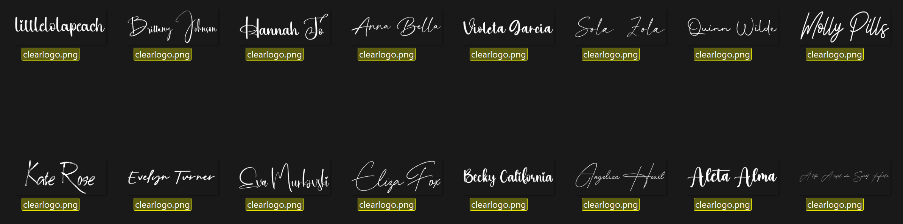

Note: This script is compatible with the [Jellyfin VideoOSD Artwork Display](https://github.com/chrissix666/Jellyfin-VideoOSD-Artwork-Display).

# Bulk Subfolder Clearlogo Creator From Fonts

**Note:** This tool does not work on files (e.g. `.mp4`, `.mkv`) — it works on **subfolders**. It scans each subfolder of your chosen library paths and creates/replaces a `clearlogo.png` inside each one.

(*If you want different behavior — for example, targeting specific video files instead of subfolders — feel free to adjust the code to your needs. For a script this small, an AI tool can help you make those changes quickly.)

## Purpose

Originally built to generate clearlogos for **Home Videos in Jellyfin** — content that will never have official artwork on fanart.tv, since it isn't a commercial movie or show. It can be used anywhere clearlogos work, e.g. Jellyfin, Emby, Kodi, Plex.

Think of it as a small **companion to fanart.tv**, just for your own Home Videos: instead of a missing-artwork gap, every folder gets a clean, readable, auto-generated logo based on its folder name.

My personal use: I use specific Title Fonts for Topic folders & random Signature fonts for Person/Character folders.



## Aspect Ratio

The output image is **800x310**, intentionally following the **fanart.tv clearlogo convention** — not Jellyfin's 16:9 default — so generated logos stay consistent with real scraped clearlogos from fanart.tv.

## Fonts: Random or Specific

Supported font types: .ttf & .otf

The `fonts` folder controls the behavior:
- **One font in the folder** → that exact font is used for every logo (specific/targeted)
- **Multiple fonts in the folder** → a random font is picked per folder (random bulk creation)

Note: Not all fonts support special characters from other languages (e.g. ä, ö, ü) — check the font beforehand especially on bulk/random use.

## Styling

The script is designed to produce **white logos with a light black outline**, for consistent readability over any backdrop, poster, or dark background.

(*If you want different behavior — for example, specific colors or borders  — feel free to adjust the code to your needs. For a script this small, an AI tool can help you make those changes quickly.)

## Modes

- **Update** — only creates `clearlogo.png` where missing
- **Replace** — regenerates `clearlogo.png` for every folder
- **Dry Run** (for both) — simulates the run, writes nothing, only reports what would happen

Full run statistics (created, replaced, skipped, errors, runtime) are printed at the end.

## Requirements

- Python 3.x
- **Pillow** (image library, required) — install with:
```
  pip install pillow
```

## Setup

1. Create a project folder and name it whatever you want. Put the Python `.py` script and the Batch `.bat` file into it.
2. Create a folder called `fonts` inside it and put **1 font** in for specific selection, or **more fonts** in for random selection.
3. Create a text file called `paths.txt` in the project folder. Put the paths in which the subfolders should get a `clearlogo.png`, one path per line (line break).
4. Run the script with the `.bat`. Test with Dry Run first.

**Note:** It will **not** create `clearlogo.png` directly in the paths you list — only inside their **subfolders**.

## Tested on

- Windows 11
- Jellyfin Web
- Python 3
  
## License

MIT
